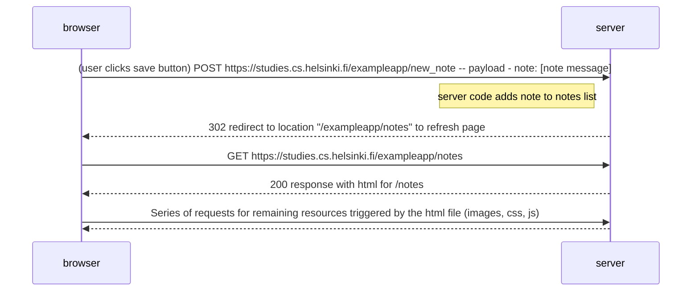

```mermaid
sequenceDiagram
  participant browser
  participant server

  browser->>server: (user clicks save button) POST https://studies.cs.helsinki.fi/exampleapp/new_note -- payload - note: [note message]

  note left of server: server code adds note to notes list  

  server-->>browser: 302 redirect to location "/exampleapp/notes" to refresh page
  browser->>server: GET https://studies.cs.helsinki.fi/exampleapp/notes
  server-->>browser: 200 response with html for /notes
  browser->>server:   Series of requests for remaining resources triggered by the html file (images, css, js)
  server-->>browser: 
```