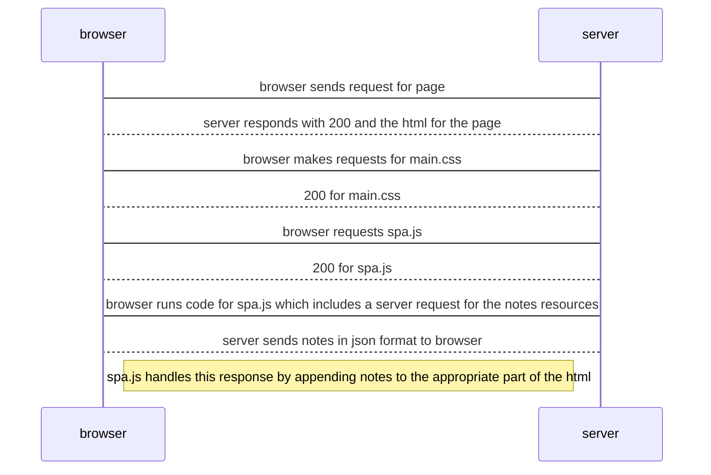

```mermaid
sequenceDiagram
  participant browser
  participant server

browser->server: browser sends request for page
server-->browser: server responds with 200 and the html for the page
browser->server: browser makes requests for main.css
server-->browser: 200 for main.css
browser->server: browser requests spa.js
server-->browser: 200 for spa.js
browser->server: browser runs code for spa.js which includes a server request for the notes resources
server-->browser: server sends notes in json format to browser

note right of browser: spa.js handles this response by appending notes to the appropriate part of the html
```