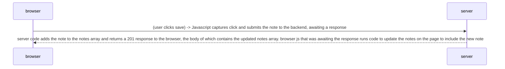

```mermaid
sequenceDiagram
  participant browser
  participant server

  browser->>server: (user clicks save) -> Javascript captures click and submits the note to the backend, awaiting a response
  server-->>browser: server code adds the note to the notes array and returns a 201 response to the browser, the body of which contains the updated notes array. browser js that was awaiting the response runs code to update the notes on the page to include the new note

```