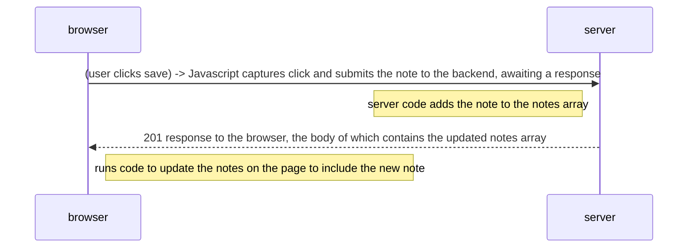

```mermaid
sequenceDiagram
  participant browser
  participant server

  browser->>server: (user clicks save) -> Javascript captures click and submits the note to the backend, awaiting a response

  note left of server: server code adds the note to the notes array

  server-->>browser:  201 response to the browser, the body of which contains the updated notes array

  note right of browser: runs code to update the notes on the page to include the new note

```